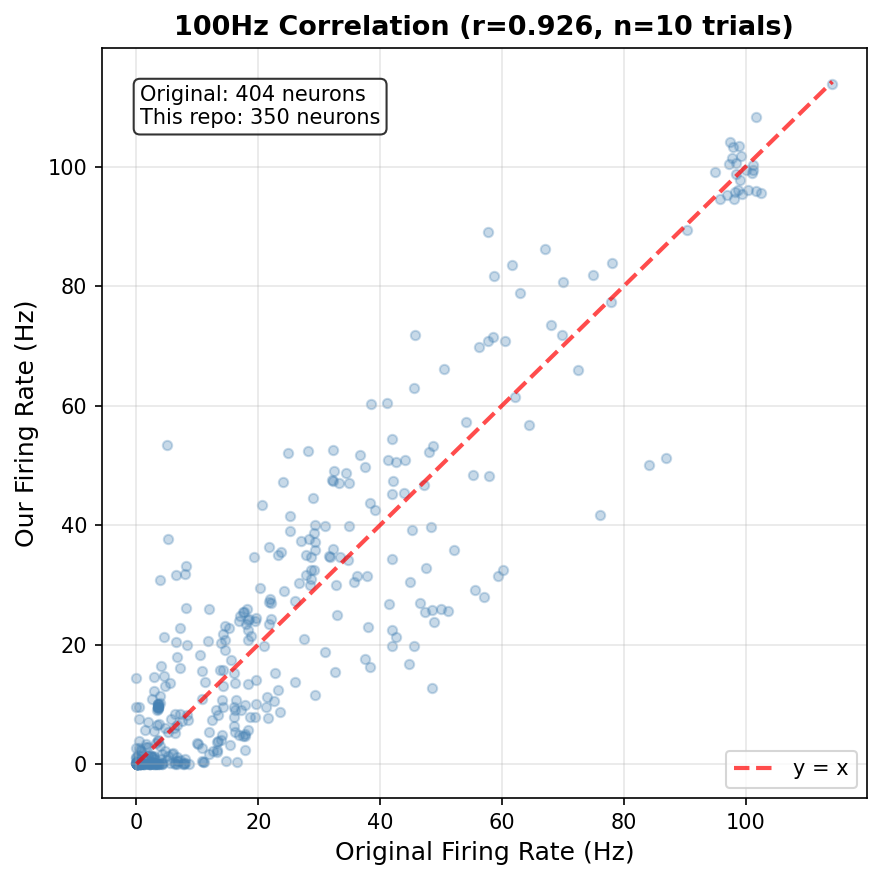
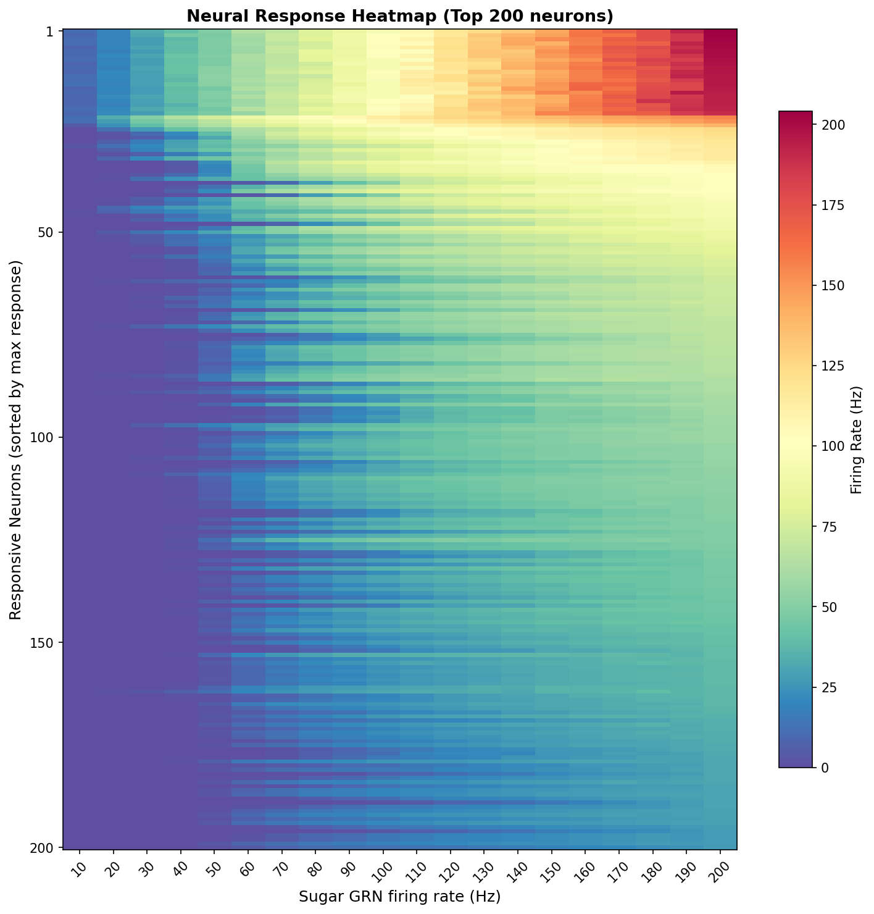
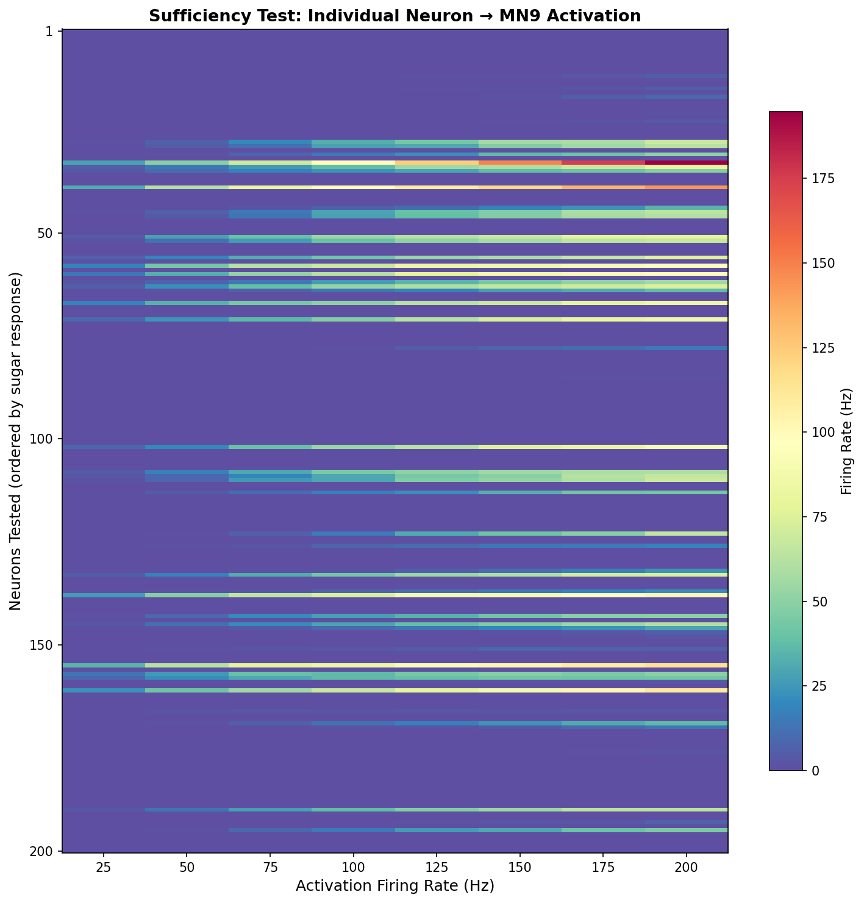
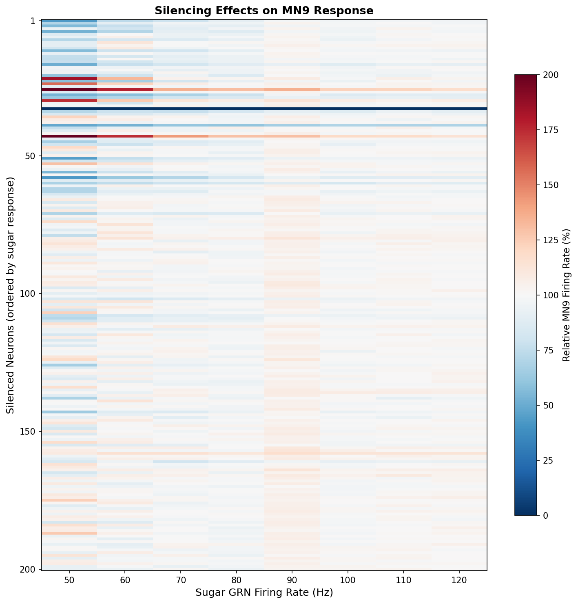
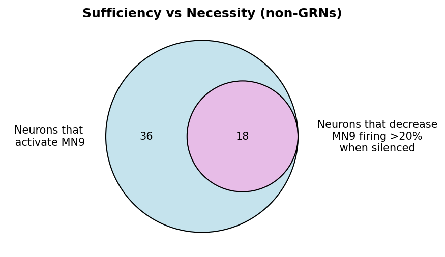
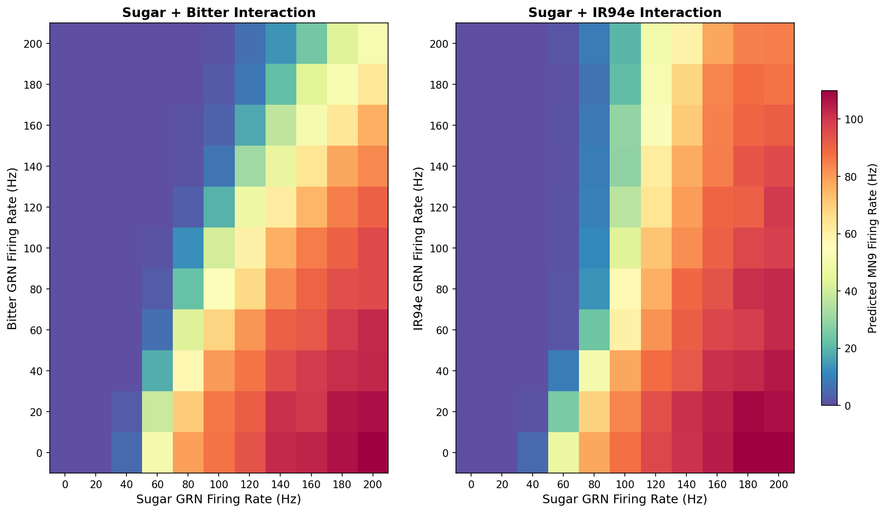

# FlyLIF: Drosophila Brain LIF Model Reproduction

An independent re-implementation of Shiu et al. (2024, *Nature*), reconstructing the gustatory sensorimotor circuit model from the paper's methods with original engineering optimizations for local-scale execution.

This project was developed as a self-directed effort to integrate computational circuit modeling with my experimental background in sensory neuroscience.

[](https://www.python.org/downloads/)
[](https://brian2.readthedocs.io/)
[](LICENSE)

---

## 1. Overview
Understanding how sensory inputs are transformed into motor outputs is a central problem in neuroscience. This repository reproduces the core taste-to-motor transformation circuit identified in **Shiu et al. (2024)**, where activation of sugar gustatory receptor neurons (GRNs) propagates through the *Drosophila* brain to drive proboscis extension.

The circuit scaffold is constrained by the **FlyWire v783** whole-brain connectome (~139,000 neurons, ~2.7 million synapses), utilizing unilateral 21 Sugar GRNs as sensory input and the proboscis extension motor neuron 9 (MN9) firing rate as the primary behavioral readout.

To model brain-scale circuit dynamics, the simulation employs a **Leaky Integrate-and-Fire (LIF)** framework. This abstracts each neuron as a fundamental RC circuit, where the lipid bilayer acts as a capacitor and ion channels as resistors, balancing biological realism with computational efficiency. Each neuron's subthreshold dynamics follow:

$$\tau_m \frac{dv}{dt} = (v_{rest} - v + g_{syn})$$

where $v_{rest}$ is the resting potential, $\tau_m$ the membrane time constant, and  $g_{syn}$ represents the integrated synaptic conductances derived directly from FlyWire connectivity weights. 

To solve these dynamics across millions of synapses, the model is implemented using the **Brian2** simulation engine, leveraging its C++ code-generation backend to ensure high-performance numerical integration on local hardware.

### Experimental Pipeline:

1.  **Baseline Frequency Sweep:** Validating signal propagation from Sugar GRNs to downstream targets ($r = 0.93$ correlation with original findings).
2.  **Sufficiency Screening:** Identifying individual interneurons capable of independently driving MN9 activation.
3.  **Necessity Analysis:** Systematically "silencing" top-responsive neurons to identify essential circuit nodes gating the motor command.
4.  **Dual-Modality Interaction:** Characterizing how aversive inputs (Bitter and $Ir94e^+$ GRNs) non-linearly inhibit sugar-evoked motor output.

### Key Contributions

1.  **Rigorous Validation Across Connectome Versions**: The reproduction achieves a Pearson correlation of *$r = 0.93$* with original results at 100 Hz stimulation, with residual discrepancies systematically traced to connectome refinements between **FlyWire v630 → v783**. To confirm that model predictions arise from **biological circuit organization** rather than generic network properties, a **shuffled connectivity control** was implemented: **100/100** simulations activated MN9 with the true connectome versus **0/100** with randomized topology (**$p < 0.001$, Fisher’s exact test**).

2.  **High-Performance Local Simulation**: To enable **brain-scale simulation (~139,000 neurons, ~2.7 million synapses)** within a **16 GB RAM constraint**, two core optimizations were implemented. A **SIMD-vectorized `PoissonGroup`** reduced per-simulation runtime by **2–5×**, making large-scale frequency sweeps feasible on standard hardware. A **`joblib` multi-processing pipeline + shared memory-mapped connectivity** further reduced per-worker network build time from **28s → 7s**, enabling **1,600+ simulations** without memory growth.

3. **Engineering Stability & Optimization**: For necessity screening across **1,600 conditions** (200 neurons × 8 frequencies), a **threshold-based active gate silencing protocol** ($v > v_{th}\ \text{and}\ \texttt{silenced} == 0$) reduced per-silencing overhead from **~0.5s to <0.001s**. For long-run stability, a **real-time Checkpoint Manager** enables interruption and seamless resumption, while an **automated Brian2 cache recovery system** resolves compilation deadlocks, ensuring **reliable multi-day execution**.

5. **Circuit-Level Biological Insight**: Systematic necessity screening identified **18 critical interneurons** whose silencing significantly reduces MN9 output. Connectivity analysis reveals a **hierarchical circuit structure**, where a small set of critical hub neurons gate the transition from **distributed sensory representation → focused motor command**, consistent with and extending the circuit logic of Shiu et al. (2024).

---

## 2. Key Results

### 1. Baseline Frequency Sweep

**1.1 Validation against original paper (100Hz):**

<div align="center">

</div>

- **Statistical Alignment:** Achieved high correlation (**r = 0.93**) and Jaccard Similarity (**0.82**), confirming the simulation's core logic matches the original study

- **Version-Driven Discrepancy:** Active neuron counts differ (350 vs 404) primarily due to FlyWire version iteration (v630 → v783). Proofreading-driven merges and splits have refined the connectome, altering both neuron IDs and their underlying synaptic connectivity

- **Traceability Audit:** Detailed analysis confirms that unique neurons are v783-specific additions, while missing units from the original paper likely became inactive in the updated model due to connectivity refinements

- All experiments use 10 trials per condition (vs 30 in original paper) to reduce reproduction time while maintaining high correlation with original results.


**1.2 Network-wide response heatmap:** Activation of 21 Sugar GRNs (left hemisphere) across 20 frequencies (10–200 Hz). 

<div align="center">

</div>

- The heatmap displays the top 200 most responsive neurons, starting with the 21 directly stimulated Sugar GRNs, followed by downstream partners ordered by their maximum response amplitude. This visualization captures the graded, frequency-dependent recruitment of the circuit and the hierarchical flow of information from sensory inputs toward motor outputs.

**1.3 Shuffled connectivity control:** To validate that predictions depend on true circuit structure, the model was tested with randomized post-synaptic targets while preserving global connectivity statistics. 

- The shuffling destroys specific pathways (e.g., Sugar GRN → second-order neurons → premotor neurons → motor neurons) while maintaining network properties like connection counts and weight distribution. 

- Results: 100/100 simulations activated MN9 with true connectome vs 0/100 with shuffled topology (p < 0.001, Fisher's exact test), confirming model predictions arise from biological circuit organization rather than generic network properties.

**Implementation note:** While spike counts are recorded only for memory efficiency, the full spike timeseries interface is preserved in `simulation.py` (`SpikeMonitor(record=True)`) for analyses requiring temporal patterns.However, this is **not** recommended for standard local machines, as the resulting data volume will likely swamp system resources.


### 2. Sufficiency Screening

**2.1 Individual neuron activation test:** Each of the top 200 responsive neurons (identified in Exp1) was individually stimulated at 8 frequencies (25-200 Hz) to test their capability to activate the MN9 motor neuron. 

<div align="center">

</div>

- Heatmap rows ordered by sugar response (same order as Exp1) reveal that only a subset of sugar-responsive neurons are sufficient to drive motor output when activated alone. This identifies neurons with strong direct or indirect projections to the motor circuit.


### 3: Necessity Analysis

**3.1 Silencing experiment design:** Each of the top 200 responsive neurons was individually silenced while continuously activating the 21 Sugar GRNs at 8 frequencies (50-120 Hz). 

<div align="center">

</div>

- Heatmap shows relative MN9 firing rate (normalized to control with no silencing) when each neuron is individually silenced, tested across 8 frequencies (50-120 Hz).Neurons ordered by sugar response (same as Exp1). Blue regions indicate neurons whose silencing reduces MN9 activity, identifying circuit components required for motor output.

- **Note:** Silencing via active gate: threshold condition `v > v_th and silenced == 0` blocks spike generation (logically equivalent to infinite threshold) without modifying synaptic weights, avoiding Brian2 recompilation overhead (~0.5s/neuron). Biologically models complete neuronal inactivation (e.g., optogenetic inhibition, TTX application).

**3.2 Sufficiency vs Necessity analysis (non-GRN neurons):** Venn diagram depicting the intersection between neurons predicted to activate MN9 and neurons predicted to cause a 20% decrease when silenced.

<div align="center">

</div>

- Among the 200 neurons tested (excluding 21 Sugar GRNs and 2 MN9 motor neurons), **36 neurons** were sufficient (capable of activating MN9 when individually stimulated) and **18 neurons** were necessary (required for MN9 activation in sugar circuit). The overlap reveals neurons that are both capable of driving and required for maintaining motor output, representing critical circuit interneurons.

**3.3 Circuit organization:** Architectures of neuronal circuits from Sugar GRNs through the 18 neurons to MN9 motor output. 

<div align="center">

</div>

- Neurons are organized by circuit layer based on FlyWire annotations and connectivity analysis. Arrow thickness represents synaptic strength (connection count). This reveals the multi-synaptic pathway structure underlying sugar-evoked motor responses.

- **Note:** Neurons with curated annotations in FlyWire are represented by their specific functional names (with parenthetical descriptions), whereas neurons with the 'CB' prefix are identified by their cell body fiber bundles (lineages) and currently lack specific functional or morphological nomenclature, retaining their systematic cluster codes instead.


### 4.Dual-Modality Interaction
**4.1 Sugar × Bitter and Sugar × Ir94e interactions:** Predicted MN9 firing rates across 11×11 frequency grids (0-200 Hz for both modalities), revealing non-linear interactions between appetitive and aversive sensory inputs.

<div align="center">

</div>

- Both bitter and Ir94e aversive modalities suppress sugar-triggered MN9 activity, consistent with the original paper's findings that aversive taste inputs inhibit feeding motor output.

- Under high sugar GRN activation (200 Hz), strong bitter activation potently suppresses MN9 firing (~40 Hz), while equivalent Ir94e activation produces only partial inhibition ( ~ 80 Hz) . This differential potency is consistent with the original paper's computational predictions and behavioral validation experiments.

---

## 3. Implementation
### 1. PoissonGroup Vectorized Architecture

Experiments 1, 3, and 4 require the simultaneous activation of 21 Sugar GRNs. With over 1,600 simulation conditions, the efficiency of these sensory inputs is critical for project feasibility.

**Technical Implementation:**

* **Individual Approach:** In early iterations, creating 21 independent input sources required the simulator to manage 21 separate event-scheduling objects. This fragmented the memory access patterns and prevented the compiler from applying global optimizations.
* **Vectorized `PoissonGroup`:** By defining the 21 GRNs as a single `PoissonGroup`, the threshold condition `rand() < rates*dt` is evaluated as a **Single Instruction, Multiple Data (SIMD)** operation. This treats the 21 neurons as a continuous memory block, effectively removing the per-neuron management overhead.

<center><b>Comparative Analysis of Implementation Strategies</b></center>

| Feature | Individual Object Approach (`PoissonInput`) | **Vectorized Architecture (`PoissonGroup`)** |
| --- | --- | --- |
| **Mathematical Basis** | ISI tracking (Exponential) or independent Binomial sampling. | **Probability-based vectorized sampling.** |
| **Core Formulation** | $f(t; \lambda) = \lambda e^{-\lambda t}$ (per input). | **$P(\text{spike}) \approx \lambda \cdot dt$ (per group).** |
| **Computational Logic** | **Event-Driven:** Maintains 21 independent event queues and timers. | **Time-Driven:** Unified probability check `rand() < λ·dt` for all neurons. |
| **C++ Compilation** | **Fragmented:** Each unique configuration triggers redundant `clang++` object compilation. | **Unified:** Single optimized C++ template processing all neurons in one pass. |
| **Memory & CPU** | **O(N) overhead:** Fragmented memory access and high per-neuron management. | **O(1) overhead:** Continuous memory block utilizing **SIMD** parallel evaluation. |
| **Observability** | **Limited:** Difficult to extract individual spike timings for all 21 GRNs. | **High:** Full support for `SpikeMonitor` to track precise spatiotemporal patterns. |
| **Performance** | Triggers frequent C++ recompilation (10-60s hangs) → unstable runtime (~170-600s per task). | Unified compilation path → stable runtime (~50-200s, 2-5× faster). |


**Conclusion:** Both methods are biologically equivalent (producing independent Poisson spike trains). However, the vectorized `PoissonGroup` architecture reduced the total projected runtime for 1,600 simulations.
This optimization was the key enabler for conducting large-scale parameter sweeps on local hardware.

### 2. Targeted Neuron Silencing

In Experiment 3, the protocol requires systematically silencing each of the 200 neurons individually to assess their contribution to the circuit. This large-scale ablation study demands a high-performance method for switching neuronal states between simulation runs.

**Implementation Strategies:**
The original study utilized a weight-zeroing approach, while this reproduction adopted an active threshold gate to optimize for local runtime.

<center><b>Comparison of Silencing Methods</b></center>

| Feature | Weight-Zeroing (Original Paper) | **Active Threshold Gate (This Repo)** |
| --- | --- | --- |
| **Method** | Sets all outgoing synaptic weights to zero. | Introduces a `silenced` flag in the neuron model. |
| **Backend** | Modifies the synaptic weight matrix. | Modifies a scalar state variable. |
| **Silencing Overhead** | ~0.5s per neuron (Brian2 array access update) | <0.001s (direct parameter assignment) |
| **Biol. Fidelity** | Disconnects synaptic transmission. | Blocks spike generation while preserving subthreshold membrane dynamics. |

**Technical Implementation:**
```python
# Model equations (parameters.py)
eqs = '''
    dv/dt = (v_0 - v + g) / t_mbr : volt (unless refractory)
    silenced : integer             # 0 = Active, 1 = Silenced
'''
# Spike only if threshold is met AND gate is open
threshold = 'v > v_th and silenced == 0' 
```

**Conclusion:** Both approaches achieve biological silencing; **Active Threshold Gate** was chosen for performance — enabling rapid repeated silencing (1,600 operations: <1 second vs ~13 minutes), critical for systematically testing each of 200 neurons in Exp3.

*Note: This optimization is distinct from the PoissonGroup improvement, which addresses full C++ compilation delays (10-60s).*

### 3. Worker Process Isolation & Data Flow Optimization

Experiments 2-4 involve thousands of independent simulations (e.g., Exp2: 1,600 neuron-frequency pairs). Parallel execution is essential, but Brian2's global state management creates challenges in multi-processing environments.

**Brian2 global state challenges:**

| **Global State Component** | **Potential Failure (If Not Isolated)** |
|----------------------------|------------------------------------------|
| Network Objects            | ⚠️ Name Collisions (namespace interference) |
| Compiled Modules           | ⚠️ Stale References (invalid C++ pointers) |
| Namespace Variables        | ⚠️ Memory Accumulation (cumulative leaks) |

**Multi-layer architecture:**
```
Main Process (orchestration)
├── Load DATA once (shared read-only via joblib)
├── CheckpointManager (tracks completed tasks)
├── Parallel() context (spawns N workers) 
│   └── Worker Process (isolated execution, 1 Task)
│       ├── start_scope()              # Clear Brian2 globals
│       ├── build_network()            # Independent network instance,once per task
│       ├── run_simulation() ── Trials 1-10 (reuse network):   # Independent Brian2.Network
│       │                       ├── net.restore('initial')     # Reset to pristine state
│       │                       ├── neu.silenced[42] = 1       # Apply silencing (if Exp3)
│       │                       ├── Create PoissonGroup        # Activate input neurons
│       │                       ├── net.run(1000ms)            # Execute 1-second simulation
│       │                       ├── Extract spike counts       # SpikeMonitor.count
│       │                       └── net.remove(monitors)       # Cleanup for next trial          
│       ├── Extract minimal results    # Only {mean, std} statistics
│       ├── Explicit cleanup
│       │   ├── del net_components
│       │   ├── del result
│       │   └── gc.collect() 
│       └── Return tuple               # (neuron_id, freq, stats, task_key)
│
└── Generator-based result collection
```

**3.1 Input Optimization: Preprocessed Connectivity**

Raw FlyWire data (~1.1GB) is preprocessed once at load:
- **Filter weak connections:** syn_count < 5 pruned (84% row reduction)
- **Precompute neuron signs:** Excitatory/inhibitory determined from neurotransmitter probabilities, removing redundant columns
- **Memory mapping:** Reduced 350MB DATA object (68% reduction) shared across workers via joblib, avoiding duplication
- **Impact:** Network build time 28s → 7s per worker.

**3.2 Execution Isolation: Local Scope Management**

Each worker constructs its network instance independently:
- **Serialization constraint:** Brian2 objects contain non-picklable C++ pointers and closure-based namespaces, incompatible with inter-process communication. Local construction avoids these IPC limitations.
- **MagicNetwork reset:** `start_scope()` at task entry clears Brian2's internal registry, preventing sequential tasks within the same worker from accumulating stale network objects.
- **Impact:** Enables 1,600+ simulations in single batch without memory growth or namespace collisions, maintaining constant footprint for multi-day experiments.

**3.3 Output Optimization: Minimal Data Transmission**
Workers return summary statistics only, not raw spike data:
- **Per-task transmission:**  Full spike DataFrame → `{mean, std}` only (~100 bytes)
- **Memory reduction:** ~1000-10,000× (depending on network activity)
- Explicit cleanup (`del`, `gc.collect()`) after each task releases Brian2 object graphs
- **Impact:** Peak memory <9GB throughout 1,600+ simulations, zero swap usage.

*Note: Spike timeseries unavailable with default settings. Enable `SpikeMonitor(record=True)` if temporal analyses needed.*


### 4. Resource Management & Fault Tolerance

Experiments 2 and 3 involve ~12-13 hours of continuous computation. To mitigate risks from system interruptions (power loss, kernel crashes) or Brian2-specific bottlenecks (cache corruption), the following safeguards are implemented:

**4.1 Real-Time Checkpointing**

* **Granular Persistence:** Using `joblib`'s `return_as='generator'` enables immediate saving upon task completion.
* **Resumability:** If interrupted (e.g., at task 847/1600), the system detects existing records and resumes from task 848, avoiding redundant computation.
* **Impact:** Ensures progress is never lost during multi-day runs, even across planned system reboots or kernel restarts.

**4.2 Memory Monitoring & Swap Prevention**

* **Proactive Thresholds:** Pre-experiment checks block execution if baseline memory usage exceeds 75% or swap usage is >0.5GB.
* **Performance Stability:** By preventing silent swap usage (which causes 10–100× slowdowns in simulation speed), the system maintains a consistent 12+ hour execution velocity.
* **Impact:** Zero swap utilization was achieved across all experiments, ensuring predictable runtimes on standard 16GB hardware.

**4.3 Automated Compilation Cache Recovery**

* **Stale Lock Detection:** Audits Brian2's compilation cache (`brian_extensions/`) for orphaned lock files from previous crashes.
* **Self-Healing:** If a lock file's age exceeds 1 hour, the cache is automatically purged to ensure a clean compilation slate.
* **Impact:** Eliminates random 10-minute compilation delays and ensures a reliable "cold start" for every experiment batch.

---

## 4. Quick Start

**Requirements:** Python 3.10+, 16 GB RAM, ~2 GB disk space.

### Installation
```bash
git clone https://github.com/ruiluohub/drosophila-lif-reproduction.git
cd drosophila-lif-reproduction
pip install -r requirements.txt
```

### Data
Download the FlyWire v783 connectome data (~1.1 GB, required):
```bash
mkdir -p data_783
wget -P data_783 https://zenodo.org/records/10676866/files/proofread_connections_783.feather
wget -P data_783 https://zenodo.org/records/10676866/files/proofread_root_ids_783.npy
```

To reproduce the Experiment 1 validation plot, the original paper's reference data is also needed (~1 MB, optional):
```bash
git clone https://github.com/philshiu/Drosophila_brain_model.git
mkdir -p reference_data
cp Drosophila_brain_model/results/example/sugarR_100Hz.parquet reference_data/
rm -rf Drosophila_brain_model
```

### Running the Experiments
Launch Jupyter and run the notebooks in order:

```
jupyter notebook
```

| Notebook | Estimated Runtime | Dependencies |
|----------|------------------|--------------|
| `exp1_sugar_activation.ipynb` | ~1.5 hours | None |
| `exp2_sufficiency_test.ipynb` | ~13 hours | Exp 1 results |
| `exp3_necessity_test.ipynb` | ~13 hours | Exp 1 results |
| `exp4_dual_modality.ipynb` | ~2 hours | None |

All experiments auto-save progress and can be safely interrupted and resumed.

---

## 5. Project Structure
```
lif_simulation/
├── exp1_sugar_activation.ipynb      # Baseline frequency sweep
├── exp2_sufficiency_test.ipynb      # Individual activation test
├── exp3_necessity_test.ipynb        # Silencing experiments
├── exp4_dual_modality.ipynb         # Multi-modal interactions
│
├── flylif/                          # Core package
│   ├── core/
│   │   ├── parameters.py            # Model parameters
│   │   ├── data_loader.py           # Connectivity loading
│   │   ├── network.py               # Brian2 network construction
│   │   ├── simulation.py            # LIF simulation engine
│   │   ├── experiments.py           # Parallel experiment functions
│   │   └── cave_utils.py            #  FlyWire neuron ID ↔ annotation lookup
│   └── utils/
│       ├── checkpoint.py            # Task-level checkpointing
│       ├── memory_utils.py          # Pre-run memory checks 
│       └── visualization.py         # Plotting utilities
│
├── results/                         # Experimental outputs
│   ├── exp1_sugar_activation/
│   ├── exp2_sufficiency_test/
│   ├── exp3_necessity_test/
│   └── exp4_dual_modality/
│
├── data_783/                        # FlyWire connectivity (download separately)
├── reference_data/                  # Original paper data (optional)
├── README.md
└── requirements.txt
```

---

## 6. Data Availability

All experimental results are pre-computed and available in the `results/` directory, including figures, firing rate matrices, and identified neuron lists for each experiment. Key results can be examined without re-running the simulations.

Raw connectome data (~1.1 GB) must be downloaded separately from Zenodo (see [Quick Start](#quick-start)). The optional reference data for Experiment 1 validation is available from the [original paper's repository](https://github.com/philshiu/Drosophila_brain_model).

---


## Citation & License
**Original paper:**
```bibtex
@article{shiu2024drosophila,
  title={A Drosophila computational brain model reveals sensorimotor processing},
  author={Shiu, Peter and others},
  journal={Nature},
  year={2024}
}
```

**FlyWire connectome:**
```bibtex
@article{dorkenwald2024flywire,
  title={Neuronal wiring diagram of an adult brain},
  author={Dorkenwald, Sven and others},
  journal={Nature},
  year={2024}
}
```

MIT License - see LICENSE file for details.

## Author
**Rui Luo, PhD**

Neuroscience | Circuit | Connectomics

[](https://github.com/ruiluohub)
[](mailto:luorui.2016@tsinghua.org.cn)
